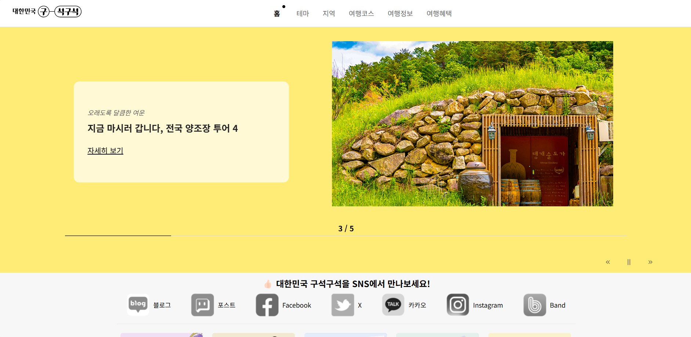
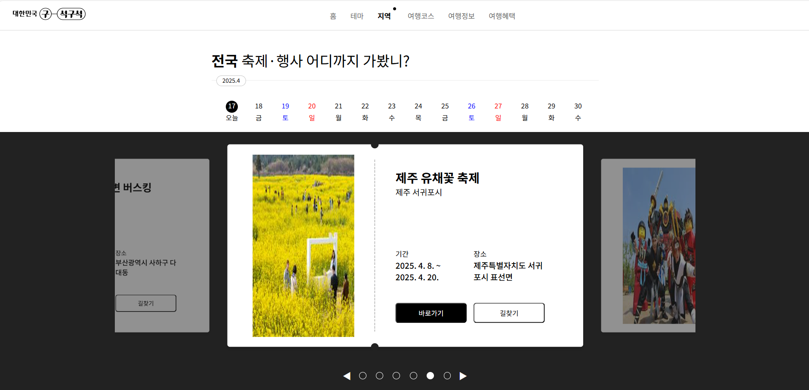
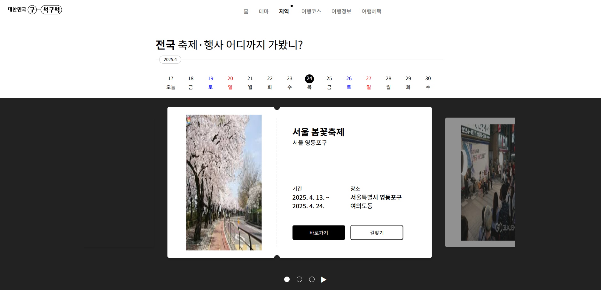
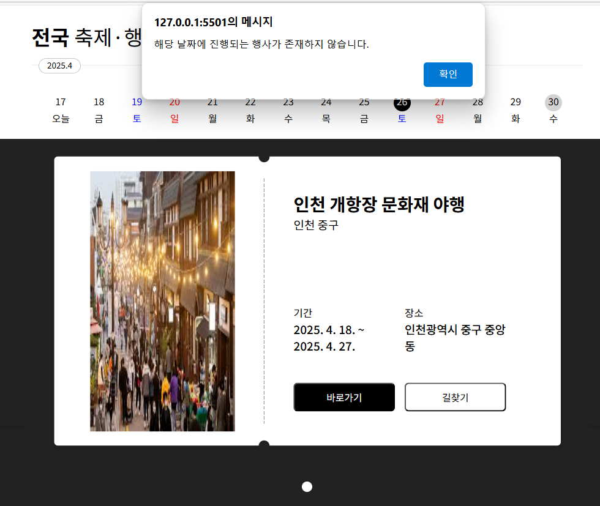
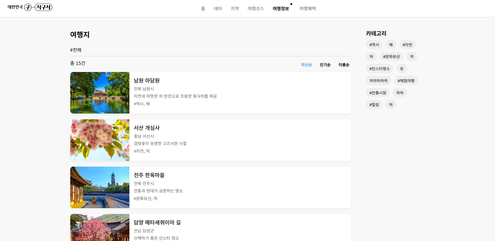
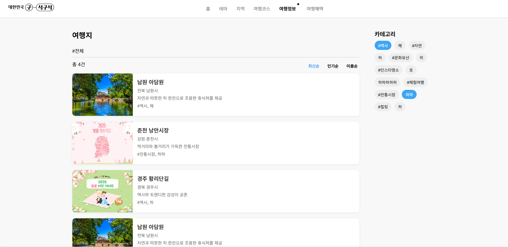

## 1. 프로젝트 주제
해당 프로젝트는 [대한민국 구석구석](https://korean.visitkorea.or.kr/main/area.do) 사이트를 HTML/CSS/JS로 제작하는 클론 프로젝트 입니다.

 

## 2. 팀원 및 역할 분담
1. 김기보 
    - 홈 화면 
    - 여행 정보 페이지  
    - 헤더, 푸터 

2. 이세영
    - 지역 축제 페이지
    - 헤더, 푸터

 

## 3. 협업 전략
**git flow** 전략 사용
- main에서 develop branch를 생성
- develop branch에서 feature/{작업명} branch를 생성
- 이후 develop 에서 3-way merge 전략을 사용하여 병합
- 작업이 모두 완료되면 main branch 업데이트

 

## 4. 페이지 소개
### 1. 메인 페이지

- 일정한 시간마다 자동으로 슬라이드가 넘어가도록 구현

- 드래그 하는 경우 다음 슬라이드로 넘어가도록 구현
- 우측 하단 Next, Prev 버튼으로 다음,이전 슬라이드로 넘어갈 수 있음
- 정지 버튼을 누를 시 자동으로 슬라이드가 넘어가지 않음.

 

### 2. 지역 행사 페이지

- 날짜를 누르면 해당 날짜가 포커스 된다. 
    - 이에 따라 아래 행사 콘텐츠도 해당 기간에 속하는 행사만 보여줄 수 있도록 자동으로 변경된다. (날짜 내에서 순서는 랜덤)
    - 행사가 없을시 행사가 없다고 알리는 alert 경고창을 사용자에게 보여준다. 
    
    

- 슬라이드 컨텐츠의 바로가기와 길찾기를 누르면 네이버에서 해당 축제를 검색한 결과 페이지로 이동된다.
- 하단의 동그라미 버튼을 누르면 해당하는 행사 슬라이드를 보여준다.
- Next, Prev 버튼을 누르면 다음, 이전 행사 슬라이드를 보여준다.
- 일정한 시간마다 자동으로 슬라이드가 넘어가도록 구현

 

### 3. 여행 정보 페이지

- 여행지에 대한 정보를 한 눈에 볼 수 있도록 만든 페이지이다.
- 우측 카테고리 버튼을 클릭하면, 카테고리별로 여행지를 검색할 수 있다.

- 최신순, 인기순, 이름순 등의 기준을 가지고 정렬하여 여행지를 검색할 수 있다.

 

### 4. 기타
- 헤더에서 아이콘을 클릭하면 그에 맞는 기능을 보여준다. (검색, 외국어 사이트, 로그인, 전체 메뉴)

 

## 5. 디렉토리 구조
1. global : 헤더, 푸터와 같이 전역적으로 사용할 수 있는 html 파일을 관리하는 디렉토리
2. html : html 파일만을 관리하는 디렉토리
3. css : css 파일만을 관리하는 디렉토리
4. js : javascript 파일만을 관리하는 디렉토리

